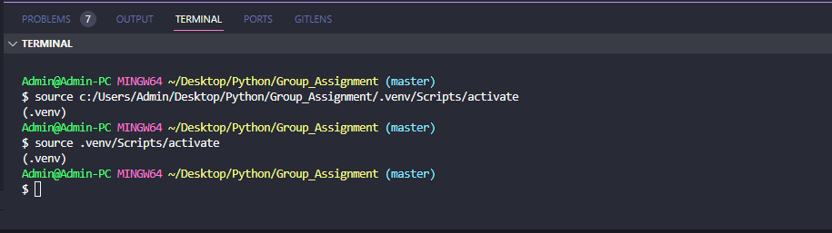

# Code Stage

Create virtual environment

    py -m venv .venv

Remember to activate the virtual environment
Activate the virtual environment

Open the **git bash** in our folder and run command

    source .venv/Scripts/activate

Screen-shot for activating virtual environment successfully:

# Install packages

To install all packages that project needs, run command:

    pip install -r requirements.txt

install pip, follow reference: [Installation - pip documentation v23.3.2 (pypa.io)](https://pip.pypa.io/en/stable/installation/)

# Start the Flask Application

run the command:

    python main.py
